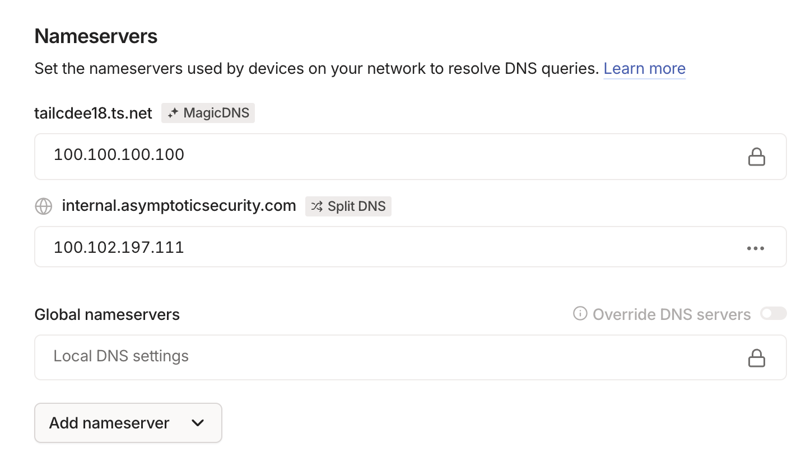

## Tailscale internal DNS configuration

Use a private DNS zone you control, or `home.arpa` for a local-only namespace. Avoid inventing a public-looking TLD for internal use.

This setup runs a small DNS server on one Ubuntu Server machine in the tailnet, then tells Tailscale to send queries for the private zone to that machine. It also avoids the common boot-time failure where `dnsmasq` starts before `tailscale0` exists.

1. Install `dnsmasq`:

   ```bash
   sudo apt update
   sudo apt install dnsmasq
   ```

2. Find the machine's Tailscale IP:

   ```bash
   tailscale ip -4
   ```

3. Create `/etc/dnsmasq.d/tailscale-internal.conf` with your internal names:

   ```conf
   # Listen on localhost and the Tailscale interface.
   listen-address=127.0.0.1
   interface=tailscale0
   bind-dynamic

   # Basic hygiene.
   domain-needed
   bogus-priv

   # Forward everything except our private zone to public resolvers.
   no-resolv
   server=1.1.1.1
   server=1.0.0.1

   # Declare our private zone as local.
   local=/internal.home.arpa/

   # Static records. These can point to the same Tailscale IP.
   address=/notes-api.internal.home.arpa/100.102.197.111
   address=/notes.internal.home.arpa/100.102.197.111
   ```

   Replace `100.102.197.111` with the Tailscale IP from step 2, and replace `internal.home.arpa` with your own private zone if you prefer to use a real domain you control.

4. If `dnsmasq` previously failed to start after a reboot, add a systemd override so it waits for Tailscale:

   ```ini
   [Unit]
   After=network-online.target tailscaled.service
   Wants=network-online.target tailscaled.service
   ```

   Save that as `/etc/systemd/system/dnsmasq.service.d/override.conf`, or create it with `systemctl edit dnsmasq`.

5. Restart and enable the service:

   ```bash
   sudo systemctl daemon-reload
   sudo systemctl restart dnsmasq
   sudo systemctl enable dnsmasq
   ```

6. In the Tailscale admin console, go to `DNS` and add the Ubuntu machine's Tailscale IP as a restricted nameserver for `internal.home.arpa` or your chosen private domain.

7. On tailnet clients, make sure they accept Tailscale DNS settings:

   ```bash
   tailscale set --accept-dns=true
   ```

8. Test name resolution from another Tailscale-connected machine:

   ```bash
   getent hosts notes-api.internal.home.arpa
   getent hosts notes.internal.home.arpa
   ```

   Or:

   ```bash
   resolvectl query notes-api.internal.home.arpa
   ```

## Configuring in Tailscale Admin Console


